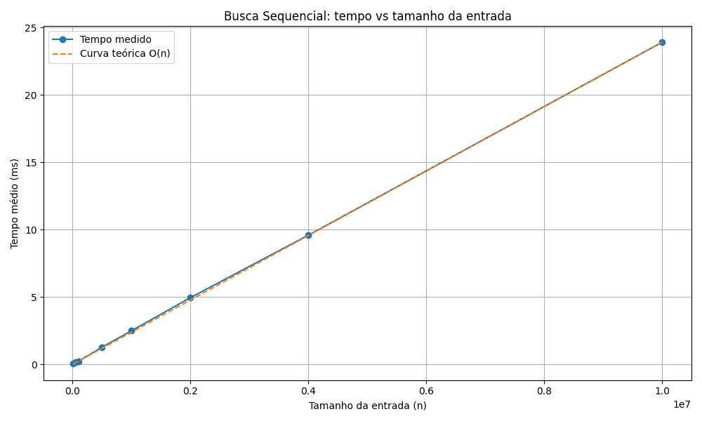
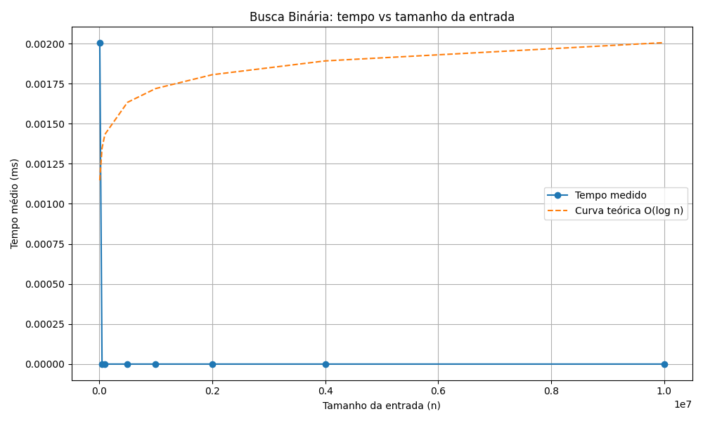
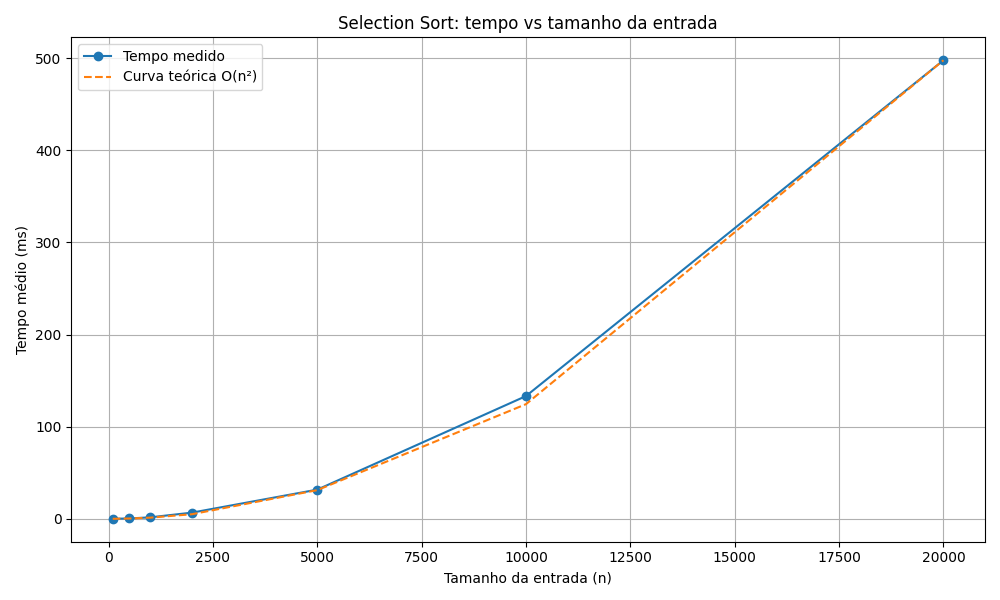
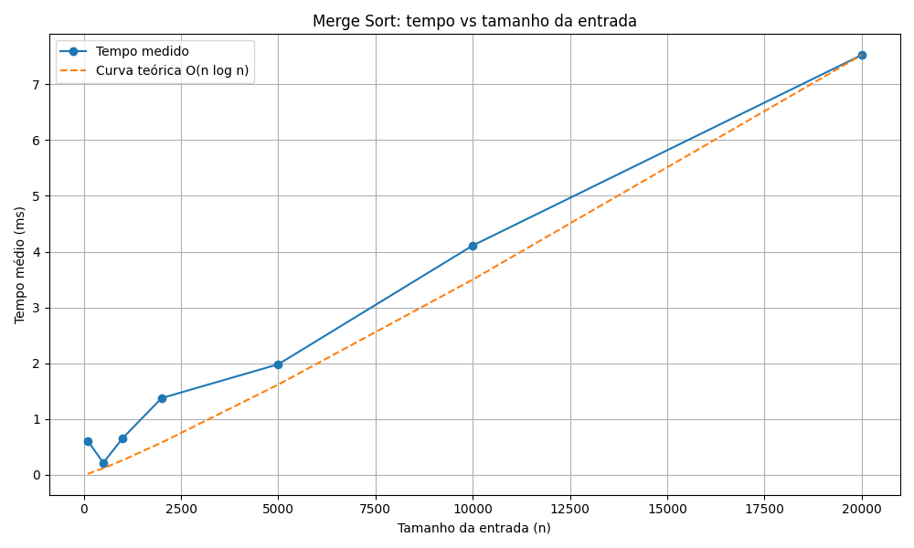

# Análise Empírica de Complexidade de Algoritmos

Projeto desenvolvido para a disciplina de **Estruturas de Dados Básicos I**, com o objetivo de analisar empiricamente o tempo de execução de algoritmos clássicos de busca e ordenação, comparando os resultados observados com funções assintóticas conhecidas.

## Objetivo

Este trabalho busca medir o tempo de execução de algoritmos para diferentes tamanhos de entrada e verificar se o crescimento empírico acompanha a complexidade teórica esperada.

Os algoritmos analisados foram:

- **Busca Sequencial**
- **Busca Binária**
- **Selection Sort**
- **Merge Sort**

## Complexidades teóricas esperadas

- **Busca Sequencial:** `O(n)`
- **Busca Binária:** `O(log n)`
- **Selection Sort:** `O(n²)`
- **Merge Sort:** `O(n log n)`

## Estrutura do projeto

```text
trabalho-complexidade-edb-I/
├── graficos/
│   ├── busca_binaria.png
│   ├── busca_sequencial.png
│   ├── merge_sort.png
│   └── selection_sort.png
├── include/
│   ├── buscas.h
│   ├── gerador_dados.h
│   ├── medidor_tempo.h
│   ├── ordenacoes.h
│   └── util.h
├── output/
│   └── main.exe
├── resultados/
│   └── arquivos .csv gerados pela execução
├── scripts/
│   └── plotar_graficos.py
├── src/
│   ├── buscas.cpp
│   ├── gerador_dados.cpp
│   ├── main.cpp
│   ├── medidor_tempo.cpp
│   ├── ordenacoes.cpp
│   └── util.cpp
├── .gitignore
└── README.md
```
## Organização dos arquivos

### `include/`
Contém os arquivos de cabeçalho (`.h`) com as declarações das funções utilizadas no projeto.

### `src/`
Contém os arquivos-fonte (`.cpp`) com as implementações dos algoritmos e funções auxiliares.

### `resultados/`
Armazena os arquivos `.csv` gerados durante a execução do programa, contendo os tempos médios medidos para cada algoritmo.

### `output/`
Armazena os executáveis gerados na compilação.

## Algoritmos implementados

### Busca Sequencial
Percorre o vetor elemento por elemento até encontrar o valor desejado ou chegar ao final.

### Busca Binária
Realiza a busca em um vetor ordenado, dividindo repetidamente o intervalo de busca pela metade.

### Selection Sort
Percorre o vetor procurando o menor elemento da parte ainda não ordenada e o posiciona corretamente.

### Merge Sort
Utiliza a estratégia de divisão e conquista, dividindo o vetor em partes menores, ordenando-as recursivamente e depois intercalando os resultados.

## Metodologia

O programa executa experimentos com tamanhos de entrada crescentes e mede o tempo médio de execução de cada algoritmo.

### Para os algoritmos de busca
- Os testes são feitos sobre vetores ordenados.
- O elemento buscado é definido de forma controlada.
- O tempo é medido várias vezes para cada tamanho de entrada.
- Ao final, é calculada a média dos tempos obtidos.

### Para os algoritmos de ordenação
- Para cada tamanho `n`, é gerado um vetor aleatório.
- Cada algoritmo ordena uma cópia do mesmo vetor original, garantindo justiça na comparação.
- O tempo também é medido em múltiplas repetições.

## Geração dos resultados

Os resultados são salvos em arquivos `.csv` na pasta `resultados/`.

Arquivos gerados:
- `tempos_busca_sequencial.csv`
- `tempos_busca_binaria.csv`
- `tempos_selection_sort.csv`
- `tempos_mergesort.csv`

Cada arquivo segue o formato:

```csv
n,tempo_ms
1000,0.0123
5000,0.0541
10000,0.1098
```

## Geração dos gráficos

Após a execução do programa principal e a criação dos arquivos `.csv` na pasta `resultados/`, os gráficos podem ser gerados com o script Python localizado em `scripts/plotar_graficos.py`.

Os gráficos são salvos na pasta `graficos/` e representam:

- tempo de execução da **Busca Sequencial** comparado com a curva teórica `O(n)`
- tempo de execução da **Busca Binária** comparado com a curva teórica `O(log n)`
- tempo de execução do **Selection Sort** comparado com a curva teórica `O(n²)`
- tempo de execução do **Merge Sort** comparado com a curva teórica `O(n log n)`

As curvas teóricas são normalizadas para permitir comparação visual com os tempos medidos experimentalmente.

### Dependências para plotagem

Para gerar os gráficos, é necessário ter Python instalado, além das bibliotecas:

```bash
pip install pandas matplotlib
```

## Compilação

No terminal, execute:

```bash
g++ -Wall -Wextra -g3 src/main.cpp src/buscas.cpp src/ordenacoes.cpp src/gerador_dados.cpp src/medidor_tempo.cpp src/util.cpp -o output/main.exe
```

## Execução

Após compilar, execute:

```
./output/main.exe
```

No Windows PowerShell:

```
.\output\main.exe
```

Por fim, plote os gráficos. Na raiz do projeto, execute:
```
python scripts/plotar_graficos.py
```
Após a execução, serão gerados os arquivos:

- graficos/busca_sequencial.png
- graficos/busca_binaria.png
- graficos/selection_sort.png
- graficos/merge_sort.png

## Saída esperada

Ao executar o programa, serão gerados arquivos `.csv` com os tempos médios de execução para cada algoritmo, que poderão ser usados posteriormente para:

- construção de gráficos
- comparação com curvas teóricas
- análise dos resultados no relatório final

## Tecnologias utilizadas

- `C++`
- Biblioteca padrão `<vector>`
- Biblioteca padrão `<chrono>` para medição de tempo
- Biblioteca padrão `<fstream>` para geração de arquivos `.csv`


## Fluxo de uso

```md
1. Compile o projeto em C++.
2. Execute o programa principal para gerar os arquivos `.csv`.
3. Execute o script Python para gerar os gráficos.
4. Utilize os gráficos e os dados no relatório final.
```

### Visualização dos Resultados

### Busca Sequencial


### Busca Binária


### Selection Sort


### Merge Sort


**Leia o relatório completo:** [Relatório - Análise Empírica de Complexidade](Relatorio-EDB-I.pdf)

## Observações
Este projeto foi desenvolvido com foco em modularização, clareza do código e facilidade de expansão, permitindo a inclusão de novos algoritmos futuramente.

## Autor
Leonardo Xavier Cruz Filho
